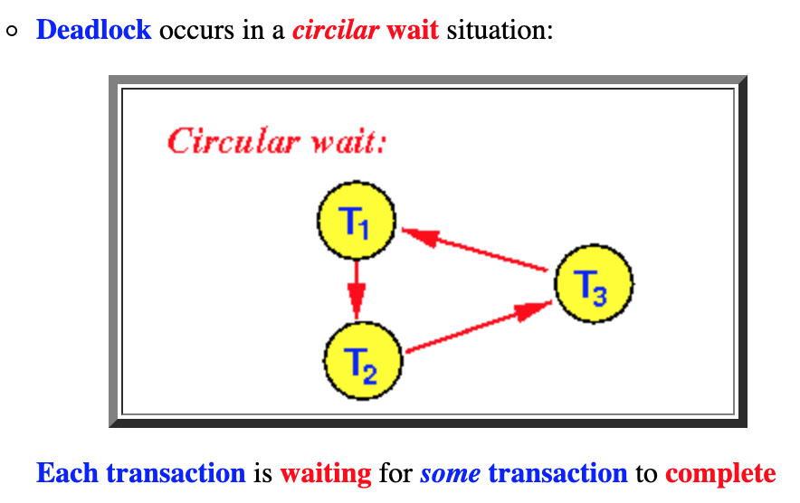
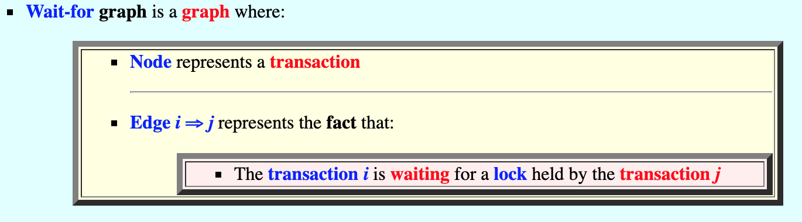
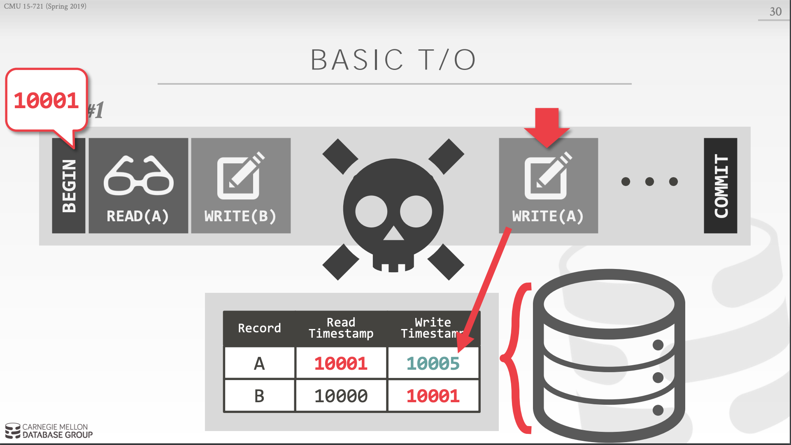
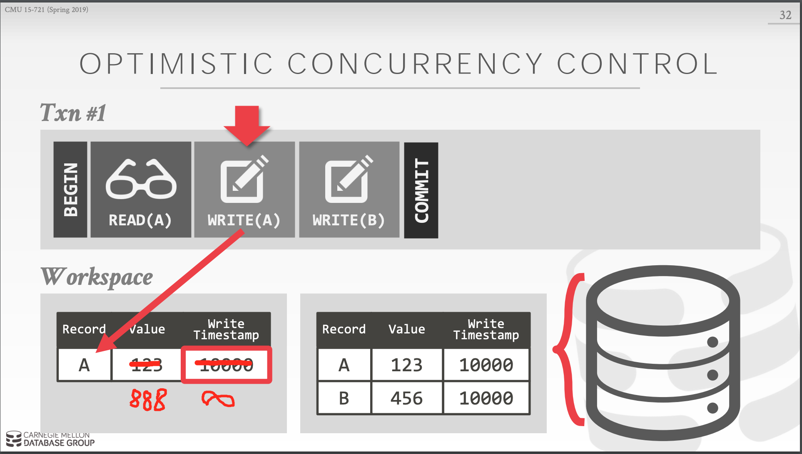

# 并发控制

事务是数据库中很重要的特性，是一些列小操作的合集，而这些集合又一个完整的整体。在多用户并发的情况下，可能会出现多个事务同时执行的场景，但是数据库中只有一份数据，在不违反数据库特性(ACID)的情况下，尽可能的提高多事务执行的效率，就是并发控制要解决的问题。

保证数据完整性最理想的方式是所有事务串行化执行，也就是一个执行完了在执行下一个，这种效率最低。

为了能压榨出更高的效率，人们想出了多个算法以允许多个事务同时进行，也就是不等前一个事务执行完，就可以开始下一个事务。

但是效率的提高也是有代价的，在引入这样的机制后，同时带来了一些可能出现的数据完整性方面的异常 (phenomena)，比如(详见参考资料 2):

* Dirty reads
* Non-repeatable reads
* Phantom reads
* Dirty writes
* Read skews
* Write skews
* Lost updates

越松的隔离要求，就意味着越高的执行效率，同时可能带来相对严重的数据完整性的问题。所以不同的并发控制算法，决定了隔离的级别。所以并发控制算法的本质上是在实现数据库特性中的 原子性 和 隔离性。

当多个用户/进程/线程同时对数据库进行操作时，会出现3种冲突情形：

1. 读-读，不存在任何问题
2. 读-写，有隔离性问题，可能遇到脏读（会读到未提交的数据） ，幻影读等。
3. 写-写，可能丢失更新

并发控制算法大体上可以分为两大类： 
* **two-phase locking (2PL)**  
* **timestamp ordering protocols (T/O)** 

具体的实现上基本上都是这两种算法的一些改进。

 

## 1. two-phase locking 两阶段锁
----
 

这种是基于锁的并发控制，这种方式是悲观的方法，因为我们先假设它会冲突，所以要先等待获取相应的锁，然后才能开始对相关资源的操作。

最简单粗暴的方式就是所有资源只有一把锁，也就是当一个事务启动后，其间所有事务都不能访问任何资源。这种情况下，数据的隔离程度最高，不会出现任何 phenomena， 因为锁的粒度最大(是整个 DB 实例下的所有库)，所以效率就低了。

在此基础之上，提高效率，于是开始降低锁的粒度，比如按表锁，行锁，页面(page)锁。所以当一个事务在执行的时候就需要获取多把锁了。因为多个 transaction 同时尝试获取不同或相同的资源，所以就会有死锁的可能。不同的 两阶段锁 的变种最大的区别就是 如何检测和处理 死锁。

两阶段锁的核心思想：

1. Different transactions cannot simultaneously own conflicting locks
 
    涉及到的锁分为 共享锁(read-only lock) 和 排它锁(exclusive lock), 顾名思义，不同的 transaction 可以同时持有相当的 共享锁 去读取资源。但是一旦资源被加上了 排它锁，那其他 transaction 既不能在加 共享锁，更不能加排它锁了。

2. Once a transaction surrenders ownership of a lock, it may never obtain additional locks

    这也就是两阶段名称的由来，两阶段指的是 growing-phase 和 shrinking-phase：
    
    在 growing-phase 阶段 transaction 可以根据需要不断的获取对应资源的各种类型的锁，但是不会释放锁，这个阶段获取的锁越来越多。

    在 shrinking-phase 阶段 transaction 开始不断释放锁。重点是，一旦 transaction 开始释放后，就不能再获取任何锁了。

    简单理解，就是第一阶段只能获得锁，第二阶段只能释放锁。

 

一个二阶段锁的例子如下图所示:

 

根据处理死锁的方式不同，大致有以下几种方法:

 

### 1.1  2PL with Deadlock Detection (DL_DETECT) 死锁检测

这种方式允许死锁的发生，并且是在死锁发生以后死锁检测机制才会生效。所以这是一种相对乐观的方法。

处理办法是直接让其中一个 transaction abort & restart。abort 的transaction， 往往是当前获取资源较少的那个。下图是一个死锁发生时的  waits-for graph：

|死锁时transactino等待的环形|图例|
|-|-|
|||
    
 

### 1.2  2PL with Non-waiting Deadlock Prevention (NO_WAIT): 防止进入死锁等待
 
顾名思义，阻止死锁的发生。所以它相对来说比较悲观。做法是在 transaction 获取锁的时候先判断会不会造成死锁，如果有可能就不让它等待，直接abort & restart。

 

### 1.3 2PL with Waiting Deadlock Prevention (WAIT_DIE): 

这种跟 2 的区别是，如果尝试获取资源锁的 transaction-B 比 已经获得该资源锁的 transaction-A 要老，那就就把资源从之前的 transaction-A 里边拿过来 给这个 比较老的 transaction-B 。然后让之前的那个 transaction-A abort & restart

 

## 2. timestamp ordering protocols 基于时间序列的方式
----
 

这种方式是给每一个 transaction 根据开始的时机，分配一个自增且唯一的时间戳，也就是给所有的 transaction 排序成一个序列。（需要注意的是，虽然有一个按时间的排序序列，但是还是允许他们并行执行的，这个跟串行执行是有本质区别的。） 这里的时间戳是主要目的是处理数据访问时的冲突。冲突检测涉及到两个方面： 

1. **检测的粒度**
   
   i.e., tuples vs. partitions

2. **检测的时机**

    (i.e., while the transaction is running or at the end

 

### 2.1 Basic T/O (TIMESTAMP):

玩法是这样的，每个 transaction 开始的时候都会得到一个 时间戳，当访问数据(tuple)的时候，就会更新该 tuple 对应的时间戳。如果在写的时候发现数据的时间戳比当前 transaction 的要新，那就是冲突了，然后 abort & restart，如下图所示,

1. 其中该条 transaction 的时间戳是 10001， 
2. 当执行 READ(A) 后，A 的 read-timestamp 变为10001 (修改的条件是 A 之前的 read-timestamp 比 10001 小)
3. 当执行 WRITE(B) 后，B 的 write-timestamp 变为10001 (修改的条件是 B 之前的 write-timestamp 比 10001 小)
4. 问题来了，当 transation 执行 write(A) 时，就冲突了，只能 abort & restart (因为此时 A 的 write-timestamp 比 10001 大)

Basic T/O 解决的是 写-写 的问题： 
    
    谁先写的早谁就先生效， 并且全局一份数据。这个是比较悲观的做法，每次写都检查全局数据的时间戳。不合法直接 abort & restart

 

 

 

### 2.2 Optimistic Concurrency Control (OCC):

这个是对于 Basic T/O 的一个改进, 解决的也是 写-写 的问题。任务事务竞争没有那么多，所以下修改的时候创建新的 copy， 并修改copy。在提交的时候在进行检查，如果当前copy修改是最新的，就提交，否则重新开始。

跟 Basic T/O 的区别是，OCC 把冲突验证放到了提交的时候

如下图所示：
1. 执行 WRITE(A) 的时候，copy 一份到 transaction 的空间， 修改数据和时间戳
2. 在提交的时候在进行验证，如果 copy 的时间戳比 最新数据的时间戳大，则执行写入操作

 

### 2.3 Multi-version Concurrency Control (MVCC)：

TODO

 

   

## 参考资料
---

 

1. [Staring into the Abyss- An Evaluation of Concurrency Control with One Thousand Cores](https://15721.courses.cs.cmu.edu/spring2019/papers/02-transactions/p209-yu.pdf)

2. [SQL Phenomena for Developers](https://dzone.com/articles/sql-phenomena-for-developers)

3. [Detecting deadlocks using wait-for graphs](http://www.mathcs.emory.edu/~cheung/Courses/554/Syllabus/8-recv+serial/deadlock-waitfor.html)

4. [Banker’s Algorithm C Program](https://www.codingalpha.com/bankers-algorithm-c-program/)

5. [How does MVCC (Multi-Version Concurrency Control) work](https://vladmihalcea.com/how-does-mvcc-multi-version-concurrency-control-work/)

6. [Read Phenomena & Isolation Levels: Databases for DevelopersView](https://livesql.oracle.com/apex/livesql/file/tutorial_GXA9ZDN9ODAIUOHO5LRWCPPQT.html)

