# 并发控制

事务是数据库中很重要的特性，是一些列小操作的合集，而这些集合又一个完整的整体。在多用户并发的情况下，可能会出现多个事务同时执行的场景，但是数据库中只有一份数据，在不违反数据库特性(ACID)的情况下，尽可能的提高多事务执行的效率，就是并发控制要解决的问题。

保证数据完整性最理想的方式是所有事务串行化执行，也就是一个执行完了在执行下一个，这种效率最低。

为了能压榨出更高的效率，人们想出了多个算法以允许多个事务同时进行，也就是不等前一个事务执行完，就可以开始下一个事务。

但是效率的提高也是有代价的，在引入这样的机制后，同时带来了一些可能出现的数据完整性方面的异常 (phenomena)，比如(详见参考资料 2):

* Dirty reads
* Non-repeatable reads
* Phantom reads
* Dirty writes
* Read skews
* Write skews
* Lost updates

越松的隔离要求，就意味着越高的执行效率，同时可能带来相对严重的数据完整性的问题。所以不同的并发控制算法，决定了隔离的级别。所以并发控制算法的本质上是在实现数据库特性中的 原子性 和 隔离性。

当多个用户/进程/线程同时对数据库进行操作时，会出现3种冲突情形：

1. 读-读，不存在任何问题
2. 读-写，有隔离性问题，可能遇到脏读（会读到未提交的数据） ，幻影读等。
3. 写-写，可能丢失更新

并发控制算法大体上可以分为两大类： 
* **two-phase locking (2PL)**  
* **timestamp ordering protocols (T/O)** 

具体的实现上基本上都是这两种算法的一些改进。

<br>

## 1. two-phase locking 两阶段锁
----
<br>

这种是基于锁的并发控制，是悲观的方法，因为我们先假设它会冲突，所以要先等待获取相应的锁，然后才能开始对相关资源的操作。

最简单粗暴的方式就是所有资源只有一把锁，也就是当一个事务启动后，其间所有事务都不能访问任何资源。这种情况下，数据的隔离程度最高，不会出现任何 phenomena， 因为锁的粒度最大(是整个 DB 实例下的所有库)，但是谈不上并发性，效率比较低。

于是人们在此基础上，且不影响数据正确性的情况下，对锁进行的改进：

1. 锁的粒度降低
   
    比如此时虽然读的是同一张表，但是 读写 不同 tuple 的多个事务也是允许并发执行的。或是 读写 的同一个库，但是不同的表，都是可以的。

2. 读写分离 （注意 读写互斥， 写写互斥， 读读可并发）

    比如通过这种办法，在粒度降低的基础上，多个事务允许同时 读 相同的 tuple(但是同时写不可以)，所以并发程度又相对提高了

因为锁的粒度降低，并且一个事务可能访问多个资源，所以在并行执行 获取锁的 时候，系统就会陷入死锁的状态。于是人们想出了不同的办法来解决死锁问题，也就是不同版本的两阶段锁实现。所以，不同的 两阶段锁 的变种最大的区别就是 如何检测和处理 死锁。

<br>

两阶段锁的核心思想：

1. Different transactions cannot simultaneously own conflicting locks
 
    涉及到的锁分为 共享锁(read-only lock) 和 排它锁(exclusive lock), 顾名思义，不同的 transaction 可以同时持有相当的 共享锁 去读取资源。但是一旦资源被加上了 排它锁，那其他 transaction 既不能在加 共享锁，更不能加排它锁了。

    可能出现这样的情况: 
       
    + 1） 当 transaction T1 在读取资源 R1 时，会先获取共享锁(只读锁)， 
    
    + 2） 如果此时 transaction T2 想要修改 R1 的话，需要获取排它锁(读写锁)，但 R1 已经有了共享锁，那 T2 就要等待 T1 释放 R1 的共享锁

    <u>所以两阶段锁中当资源被读一个 transaction 取后且释放读锁之前，其他的 transaction 是不能修改该资源的。</u>

    <br>

2. Once a transaction surrenders ownership of a lock, it may never obtain additional locks

    这也就是两阶段名称的由来，两阶段指的是 **growing-phase** 和 **shrinking-phase**：
    
    growing-phase 阶段 transaction 可以根据需要不断的获取对应资源的各种类型的锁，但是不会释放锁，这个阶段获取的锁越来越多。

    shrinking-phase 阶段 transaction 开始不断释放锁。重点是，一旦 transaction 开始释放后，就不能再获取任何锁了。

    简单理解，就是第一阶段只能获得锁，第二阶段只能释放锁。

<br>

二阶段锁的例子如下图所示:

可以看到 Bob 在 update title 时，需要等待 Alice 释放读锁。


<br>

2PL 的优劣：

- 相对纯序列化执行的改进点是，2PL 把锁的粒度降低，读写分离，使得同一组资源的多个读操作可以并发执行，同时 写-写 的问题也能解决
- 可以看到如果一个 transaction 在读取一个资源的后， 另一个 transaction 是不能执行写操作的。也就是 读-写 不能并发执行

<br> <br>

根据处理死锁的方式不同，大致有以下几种方法:

### 1.1  2PL with Deadlock Detection (DL_DETECT) 死锁检测

<br>

这种方式允许死锁的发生，并且是在死锁发生以后死锁检测机制才会生效。所以这是一种相对乐观的方法。

处理办法是直接让其中一个 transaction abort & restart。abort 的transaction， 往往是当前获取资源较少的那个。下图是一个死锁发生时的  waits-for graph：

|死锁时transactino等待的环形|图例|
|-|-|
|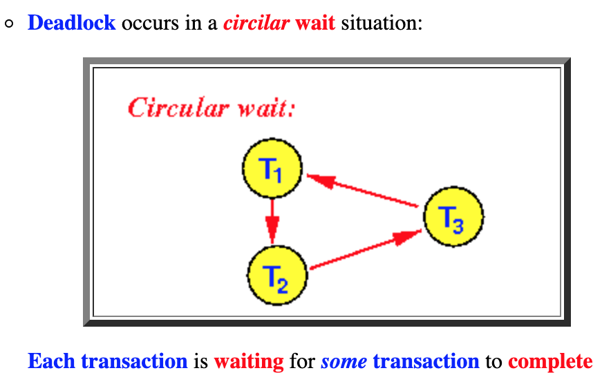|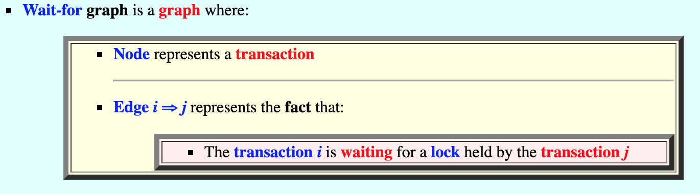|
    
<br>

### 1.2  2PL with Deadlock Prevention

<br>    

这种是预防死锁的产生，也就是在 transaction 尝试获取资源锁时，判断该资源有没有被其他 transaction 锁住。当其他资源已经获取了锁时根据是否允许当前 transaction 等待，产生了两种办法：

1. NO_WAIT： 也就是获取锁失败，直接 abort & commit
2. WAIT_DIE： 每个 transaction 都有一个时间戳，如果当前 transaction 的 时间戳比较小，那就 abort (DIE) & restart


<br>

## 2. timestamp ordering protocols 基于时间序列的方式
----
<br>

这种方式是给每一个 transaction 根据开始的时机，分配一个自增且唯一的时间戳，也就是给所有的 transaction 排序成一个序列。（需要注意的是，虽然有一个按时间的排序序列，但是还是允许他们并行执行的，这个跟串行执行是有本质区别的。） 这里的时间戳是主要目的是处理数据访问时的冲突。冲突检测涉及到两个方面： 

1. **检测的粒度**
   
    i.e., tuples vs. partitions

2. **检测的时机**

    i.e., while the transaction is running or at the end

<br>

### 2.1 Basic T/O (TIMESTAMP):

这个是悲观并发控制，对事务执行过程中的每个操作进行串行化验证。

这个玩法需要先有如下一些规则：

1. 首先，每个资源 (tuple / table / partition) 都会增加两个时间戳： Read-Timestamp 和 Write-Timestamp
2. 每个 transaction 开始的时候都会得到一个 时间戳，当访问数据(如tuple)的时候，就会更新该 tuple 对应的时间戳。
3. 当 transaction 可以读取该资源时，会copy一份到自己的 private space(因为没有锁，该资源可能随时被修改)，copy后可以重复读

<br>

具体玩法是这样的:

transaction 在读和写的时候都会尝试更新资源对应的时间戳，

* 读的流程

    注意，读操作时，数据的时间戳比自己分配的时间戳大，所以读到的必然是已经提交的数据。

    ``` cpp
    if TS < W-ts(x) then
        reject read request and abort corresponding transaction
    else
        execute transaction
        Set R-ts(x) to max{R-ts(x), TS}
    ```

* 写的流程

    所以一个事务的读操作会阻塞另一个事务的写操作

    ``` cpp
    if TS < R-ts(x) or TS < W-ts(x) then
        reject write request
    else
        execute transaction
        Set W-ts(x) to TS.
    ```

如下图所示,

1. 其中该条 transaction 的时间戳是 10001， 
2. 当执行 READ(A) 后，A 的 read-timestamp 变为10001 (修改的条件是 A 之前的 read-timestamp 比 10001 小)
3. 当执行 WRITE(B) 后，B 的 write-timestamp 变为10001 (修改的条件是 B 之前的 write-timestamp 比 10001 小)
4. 问题来了，当 transation 执行 write(A) 时，就冲突了，只能 abort & restart (因为此时 A 的 write-timestamp 比 10001 大)


Basic T/O 解决的是 写-写 的问题： 
    
    谁先写的早谁就先生效， 并且全局一份数据。这个是比较悲观的做法，每次写都检查全局数据的时间戳。不合法直接 abort & restart

<br>

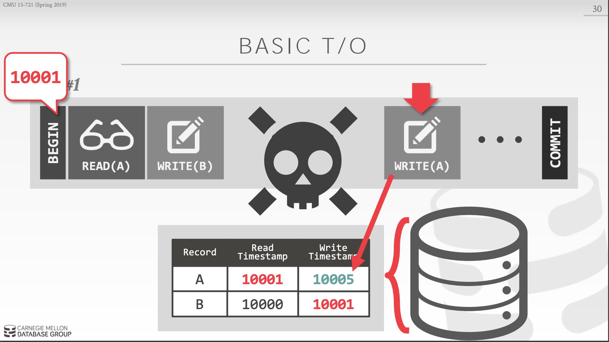

<br>

<br>

### 2.2 Optimistic Concurrency Control (OCC):

这个是对于 Basic T/O 的一个改进, 使用乐观并发控制的思想， 跟 Basic T/O 的区别是，OCC 把冲突验证放到了提交的时候，也就是在 transaction 执行的过程当中是不会校验是否冲突的。

这个算法可以分为 3 个阶段：

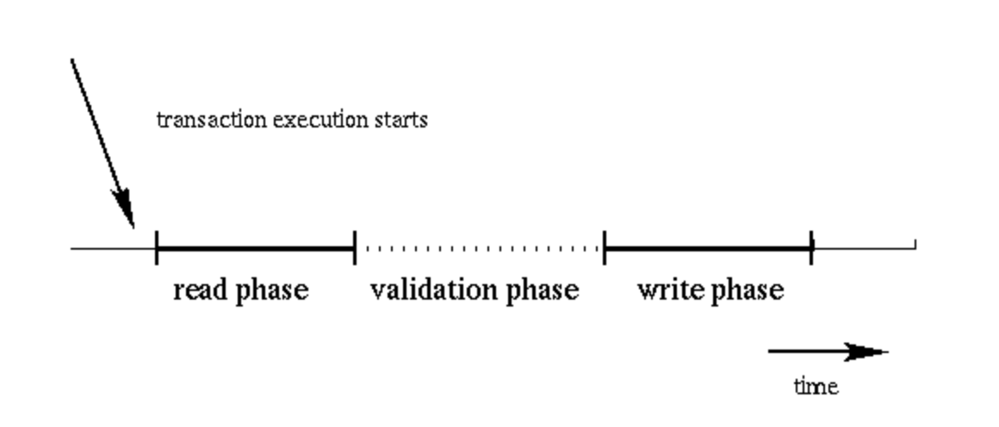

1. read phase

    数据读到私有空间，经过计算，把要修改的数据也写到私有空间

2. validation phase：

    验证是否跟其他并行的事务是否有冲突。算法如下：
    ``` cpp
    T: a transaction
    ts: the highest sequence number at the start of T 
    tf: the highest sequence number at the beginning 
        of its validation phase 

    valid:=true;
    
    for t:=ts+1 to tf do
        if (writeset(t) & readset[T] != {} ) then    
            valid :=false;
    
    if valid then {write phase; increment counter, assign T a sequence number}
    ```

3. write phase

    把数据跟新到数据库


如下图所示：
1. 执行 WRITE(A) 的时候，copy 一份到 transaction 的空间， 修改数据和时间戳
2. 在提交的时候在进行验证，如果 copy 的时间戳比 最新数据的时间戳大，则执行写入操作

<br>

|read phase|validate phase|write phase|
|-|-|-|
|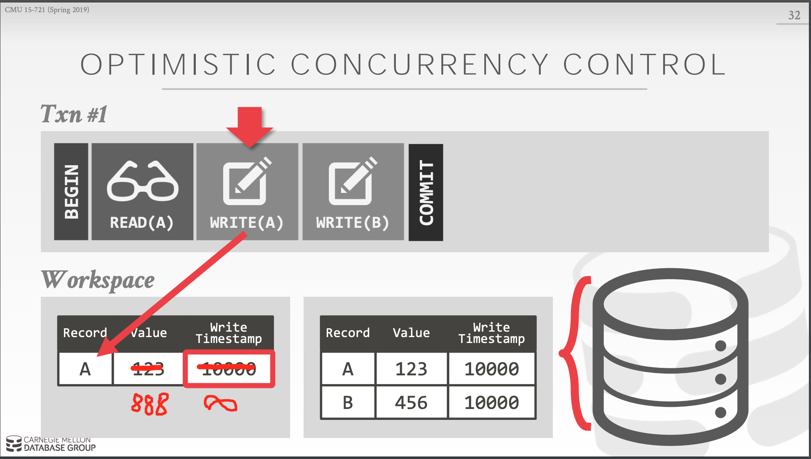|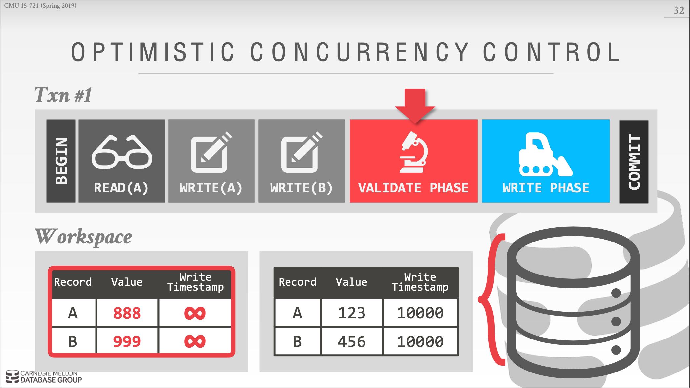|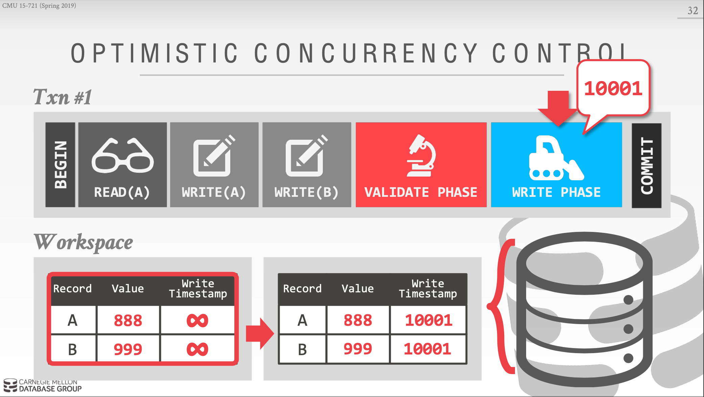|


<br>

## 3 Multi-version Concurrency Control (MVCC)：
---

多版本控制，也就是每个事务对数的修改都会产生一个版本，然后 append 到之前的版本后边，形成一个 list。通过遍历这个list 可以找到这个数据的所有版本。

这里以 MV2PL 为例，如下图所示，DB 会对每个资源维护如下的列表，其中：


|图例|表示|
|-|-|
|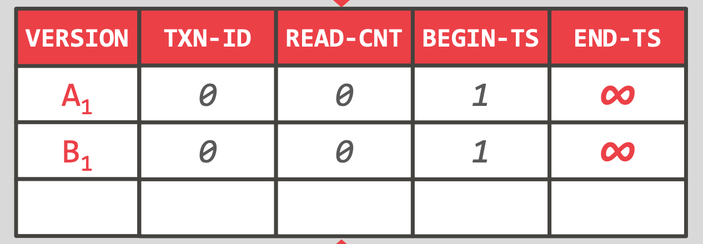|VERSION: 当前数据的版本<br>TXN-ID: 这个数据被个事务修改<br><br>READ_CNT: 这个是作为 共享锁 的使用。 跟 TXN-ID 组合可以作为 互斥锁 使用<br><br>BEGIN_TS, END_TS: 这个是该版本的有效期，即开始和结束时间|


操作步骤:
|图例|说明|
|:-|-|
|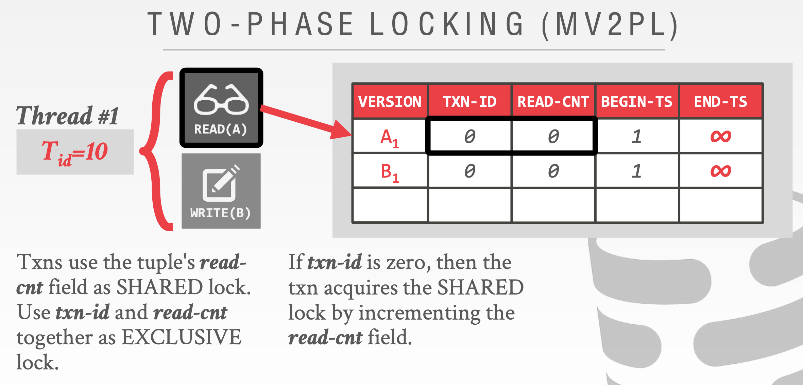|准备读取 A |
|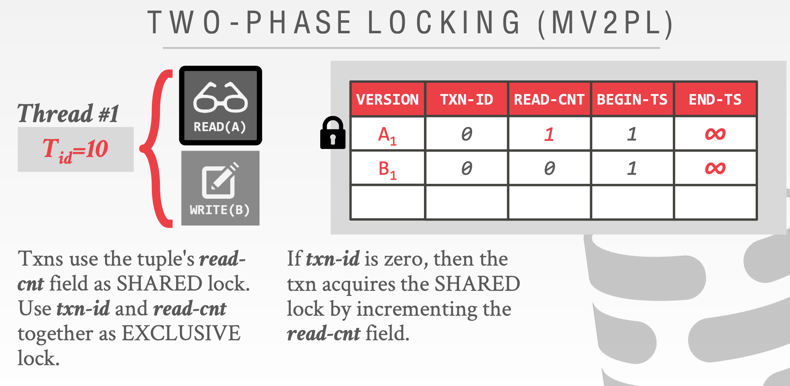|尝试对最新版本 A1 加共享锁： <br><br>当前版本 A1 的互斥锁(txn-id 为0)，可以通过 incre read-cnt 加共享锁， <br>之后 A 被读取|
|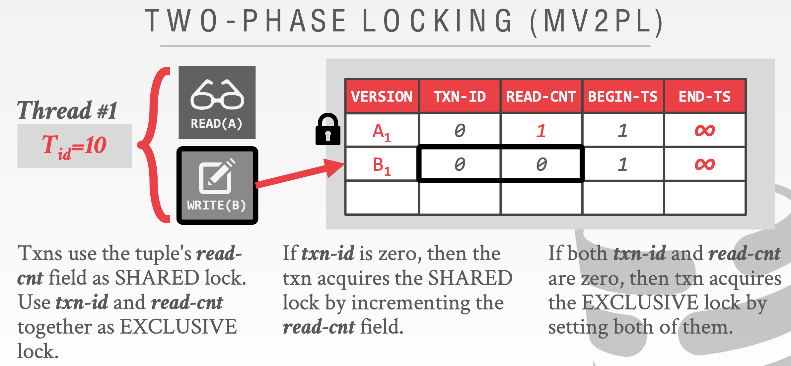|检查 B 是否可以修改：<br><br> tnx-id 和 read-cnt 均为0，所以可以修改|
|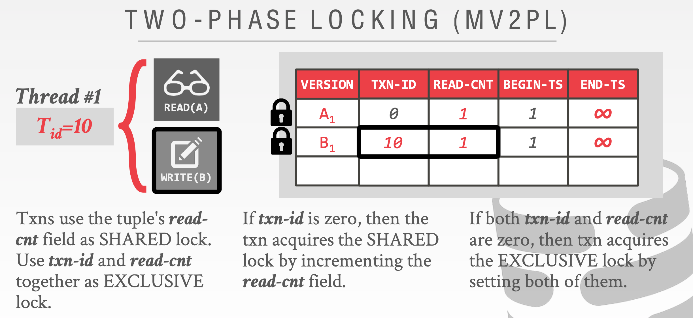|对B进行加锁: <br><br> 修改tnx-id 为当前 事务id 和 read-cnt 为1，加锁成功|
|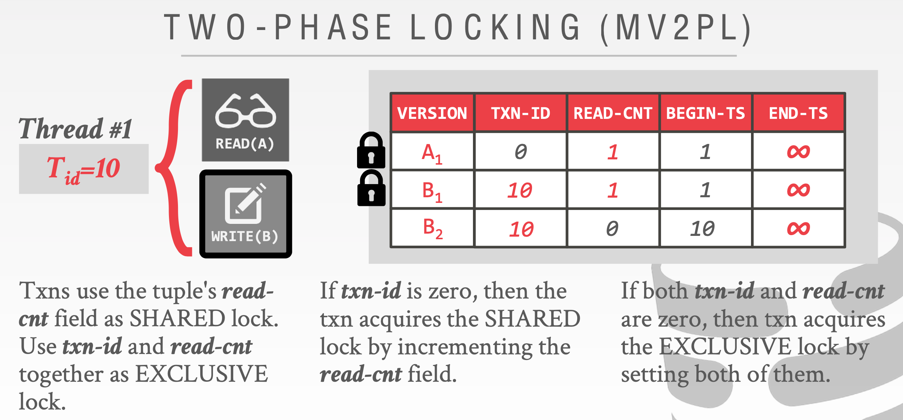|创建新的版本: <br><br> 注意这里，对B的修改，是新创建一个版本B2，同时B2的 tnx-id 是当前事务id, 即新版本也是被锁的状态|
|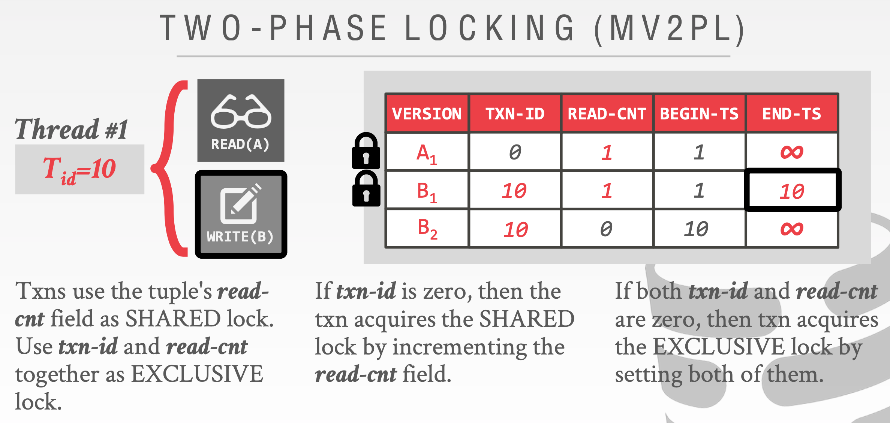|修改上一个版本的结束时间：<br><br>因为是事务修改成功，所以上一个版本 B1 就失效了。也就是要修改 B1 的结束时间为当前事务的id，表示到当前事务这条记录就失效了。至此，我们仍然锁住了3个版本|
|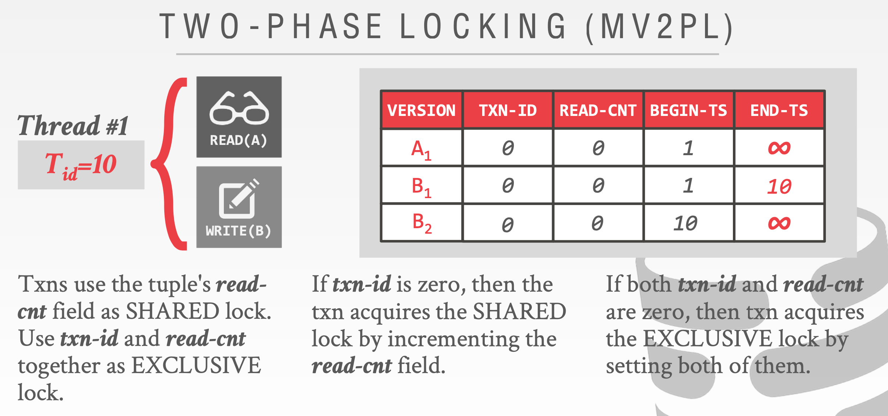|当数据提交修改成功后，我们要释放我们锁住的版本。到此提交结束|


<br>


<br><br><br>

## 参考资料
---

<br>

1. [Staring into the Abyss- An Evaluation of Concurrency Control with One Thousand Cores](https://15721.courses.cs.cmu.edu/spring2019/papers/02-transactions/p209-yu.pdf)

2. [SQL Phenomena for Developers](https://dzone.com/articles/sql-phenomena-for-developers)

3. [Detecting deadlocks using wait-for graphs](http://www.mathcs.emory.edu/~cheung/Courses/554/Syllabus/8-recv+serial/deadlock-waitfor.html)

4. [Banker’s Algorithm C Program](https://www.codingalpha.com/bankers-algorithm-c-program/)

5. [How does MVCC (Multi-Version Concurrency Control) work](https://vladmihalcea.com/how-does-mvcc-multi-version-concurrency-control-work/)

6. [Read Phenomena & Isolation Levels: Databases for DevelopersView](https://livesql.oracle.com/apex/livesql/file/tutorial_GXA9ZDN9ODAIUOHO5LRWCPPQT.html)

7. [Timestamp Based Algorithms](https://courses.cs.vt.edu/~cs5204/fall00/distributedSys/bto.html)

8. [Optimistic Algorithm](https://courses.cs.vt.edu/~cs5204/fall00/distributedSys/optimistic.html)

9. [Conservative Timestamp Ordering Algorithm](https://courses.cs.vt.edu/~cs5204/fall00/distributedSys/timestamp.html)

10. [https://yehohanan7.medium.com/mvcc-9d6f67e6d3de](https://yehohanan7.medium.com/mvcc-9d6f67e6d3de)

11. [谈谈你对Mysql的MVCC的理解？](https://baijiahao.baidu.com/s?id=1629409989970483292&wfr=spider&for=pc)

12. [MySQL 之 MVCC介绍](https://blog.csdn.net/qq_41030039/article/details/104512217)